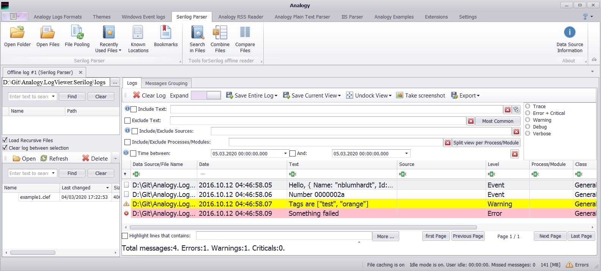

# Analogy Serilog Parser   

<p align="center">

[](https://gitter.im/Analogy-LogViewer/community?utm_source=badge&utm_medium=badge&utm_campaign=pr-badge)  [](https://dev.azure.com/Analogy-LogViewer/Analogy%20Log%20Viewer/_build/latest?definitionId=15&branchName=master)
 <a href="https://github.com/Analogy-LogViewer/Analogy.LogViewer.Serilog/issues">
    
</a>
<a href="https://github.com/Analogy-LogViewer/Analogy.LogViewer.Serilog/blob/master/LICENSE.md">
    
</a>

 [](https://www.nuget.org/packages/Analogy.LogViewer.Serilog/)
<a href="https://github.com/Analogy-LogViewer/Analogy.LogViewer.Serilog/releases">
    
</a>
<a href="https://github.com/Analogy-LogViewer/Analogy.LogViewer.Serilog/compare/V1.1.0...master">
    
</a>
</p>

Serilog Parser for Analogy Log Viewer.
Supported formatters, for now, is:
- [Compact formatting](https://github.com/serilog/serilog-formatting-compact). The initial version is based on [this project](https://github.com/serilog/serilog-formatting-compact-reader)

   example log:
   ```json
   {"@t":"2016-10-12T04:46:58.0554314Z","@mt":"Hello, {@User}","User":{"Name":"nblumhardt","Id":101}}
   {"@t":"2016-10-12T04:46:58.0684369Z","@mt":"Number {N:x8}","@r":["0000002a"],"N":42}
   {"@t":"2016-10-12T04:46:58.0724384Z","@mt":"Tags are {Tags}","@l":"Warning","Tags":["test","orange"]}
   {"@t":"2016-10-12T04:46:58.0904378Z","@mt":"Something failed","@l":"Error", "@x":"System.DivideByZer...<snip>"}
   ```



## How To Use
1. Download the latest [Analogy Log Viewer](https://github.com/Analogy-LogViewer/Analogy.LogViewer) from the [release](https://github.com/Analogy-LogViewer/Analogy.LogViewer/releases) section (.net framework or .net Core version).
2. Download (or Compile) this project and put the compiled DLL in the same folder as the Analogy Log Viewer.
